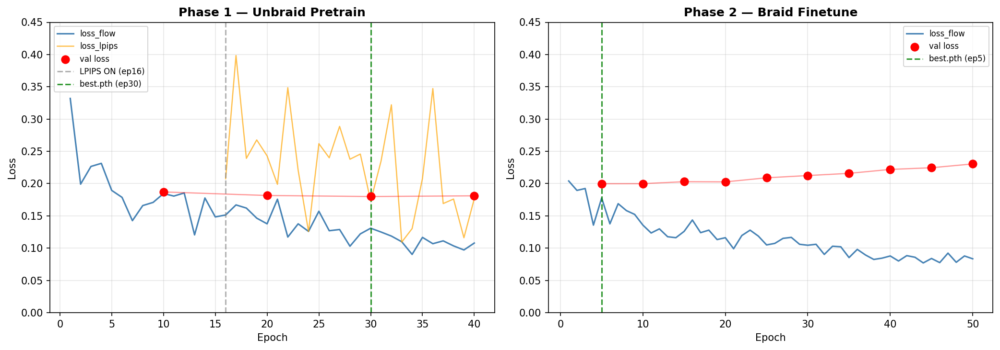

# Result 1 — Phase 1 & 2 학습 결과

## 1. Training Loss

### Phase 1 (Unbraid Pretrain)

| Epoch | loss_flow (last batch) | loss_lpips (last batch) | Val Loss |
|-------|----------------------|------------------------|---------|
| 1  | 0.3320 | - | - |
| 10 | 0.1846 | - | 0.1871 |
| 15 | 0.1484 | - | - |
| 16 | 0.1514 | 0.2076 | - |
| 20 | 0.1377 | 0.2430 | 0.1816 |
| 30 | 0.1309 | 0.1729 | **0.1800** ← best |
| 40 | 0.1079 | 0.1766 | 0.1811 |

### Phase 2 (Braid Finetune)

| Epoch | Val Loss | |
|-------|---------|--|
| 5  | **0.1998** | ← best.pth |
| 10 | 0.1999 | |
| 20 | 0.2027 | |
| 30 | 0.2125 | |
| 40 | 0.2220 | |
| 50 | 0.2305 | |

---

## 2. 사용 Checkpoint

| Phase | Checkpoint | 선택 이유 |
|-------|-----------|---------|
| Phase 1 | `checkpoints/phase1_unbraid/best.pth` (epoch 30) | val loss 최저 (0.1800) |
| Phase 2 | `checkpoints/phase2_braid/best.pth` (epoch 5) | val loss 최저 (0.1998), epoch 5 이후 overfitting |

---

## 3. Inference 결과

| 1열 | 2열 | 3열 | 4열 | 5열 |
|-----|-----|-----|-----|-----|
| Sketch | Matte | Masked Face | Generated | GT |
| 헤어 스케치 (HairControlNet 조건) | 헤어 영역 마스크 | 헤어 지운 얼굴 (FaceControlNet 조건) | 모델 생성 결과 | 정답 이미지 |

---

## 4. 실패 원인 분석

### 현상
- 생성 결과(4열)에서 braid(땋은 머리) 구조가 표현되지 않고 노이즈 또는 뭉개진 형태로 출력됨

### 원인

**Mixed Residuals의 간섭 가능성**
- blocks 18~23에서 FaceControlNet residual이 HairControlNet residual과 혼합
- braid처럼 정교한 구조 디테일이 결정되는 후반 블록에서 face residual이 섞여 구조 손상 가능성

### 개선 방향
| 문제 | 개선안 |
|------|--------|
| Face 간섭 | inference 시 face residual weight 낮춰서 실험 |
